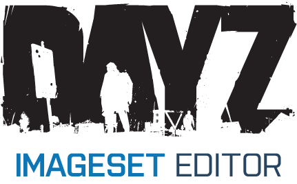

# DayZ Imageset Editor :black_nib:

A standalone, visual drag-and-drop layout editor and atlas compiler for DayZ `.imageset` configurations. This application is a lightweight, dark-themed alternative designed to completely bypass the frustrating quirks, crashes, and limitations of the DayZ Workbench UI tools.


[](https://www.gnu.org/licenses/gpl-3.0)

## My Philosophy 🔓
This utility was built by me, a humble DayZ modder, for DayZ modders. **The DayZ Imageset Editor is, and will ALWAYS remain, 100% free, open-source, and unrestricted for everyone.** It is published under the GNU GPLv3 license to ensure that the source code stays transparent and accessible to the community forever.

## Features 
#### TLDR: It's Photoshop for Imagesets! 🎨
- **Visual Layout Canvas:** Intuitively arrange, position, and pack layout elements directly on a canvas supporting sizes from 512x512 up to massive 8192x8192 texture sheets.
- **Native Imageset+EDDS Handling (Export):** Instantly compile your layout into a packed, transparent `.edds` texture sheet alongside a flawless, DayZ-ready `.imageset` file!
- **Native Imageset+EDDS Handling (Import):** Import existing `.imageset` + `.edds` directly into the application to automatically reconstruct your own creative designs.
- **Direct .EDDS Decompression:** Integrated localized extraction backend that decompresses `.edds` textures directly into readable `.png` images and automatically slices layout elements and places them into clean directories based on their group names.
- **Automated Directory-to-Group Parsing:** Imports full folder structures instantly. Selecting a root folder maps raw images to root nodes, while all subdirectories are parsed cleanly into DayZ `<Groups>` arrays.
- **Smart Alignment & Layout Utilities:** Features customizable grid-snapping, cross-element edge snapping, visible bounding box outlines for pixel-perfect alignment, and integrated layout packing routines.
- **Synchronized Hierarchy View:** Full bi-directional tree navigation. Clicking an asset in your folder hierarchy centers the canvas viewport directly on it, and selecting an element on the canvas instantly highlights its point in the layer tree.
- **Workspace Project Saving:** Progress can be seamlessly saved to a native `.json` workspace file and resumed later, tracking all spatial metrics across session reloads.

## Setup & Running From Source

If you prefer to run or modify the Python source code directly:

### Prerequisites
Make sure you have Python 3.8 or higher installed. Install the necessary UI and image processing dependencies:

```bash
pip install PyQt5 Pillow
```
-   ## Credits & Acknowledgments 🤝
    
    This tool wouldn't be possible without the excellent Go libraries created by **WoozyMasta** (github.com/woozymasta/edds and github.com/woozymasta/bcn). They handle the heavy lifting of the direct .edds processing pipeline utilized by the application's backend converter.
    
    <sub>Developed by a human and polished with a dash of AI efficiency. 🤖 _To the trolls who still can't seem to grasp how useful AI tools are for streamlining development workflows: stay salty!_</sub> 😉🧂
